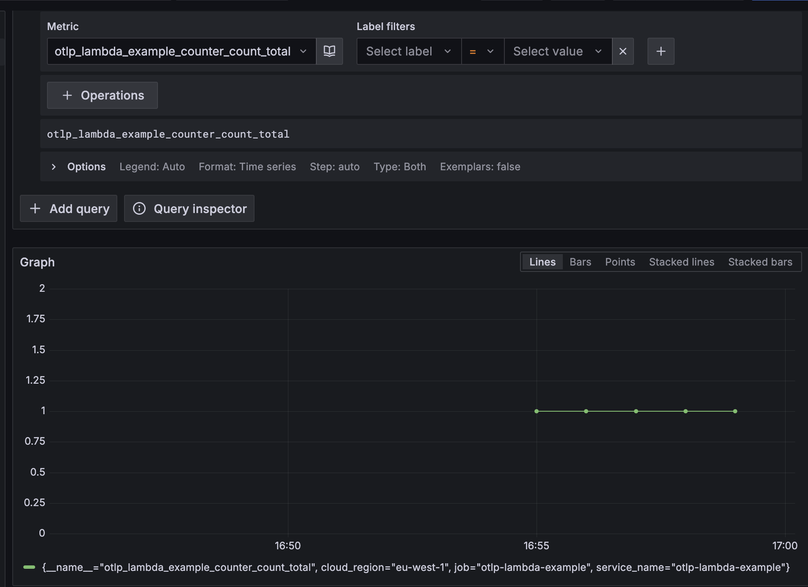
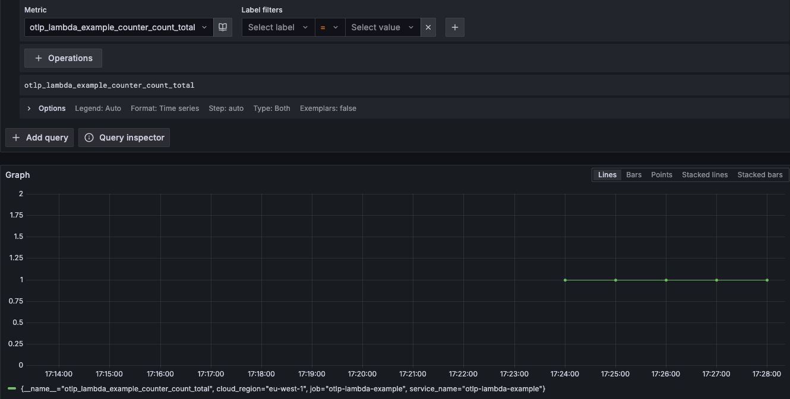

# Test Results

## Force flush

We call forceFlush on metric to trigger a flush of the metrics.

### Results

Same metric is reported 5 times, 1 minute apart.



### Logs

```
2025-09-03T14:49:58.459000+00:00 2025/09/03/[$LATEST]18f708f7238e4907bcf2efafde91f2e6 INIT_START Runtime Version: nodejs:20.v75 Runtime Version ARN: arn:aws:lambda:eu-west-1::runtime:1ffa4c233e75382c8a39aa96770f3b81af75cba9794a5c2a1750c1ee63cdfe10
2025-09-03T14:49:58.743000+00:00 2025/09/03/[$LATEST]18f708f7238e4907bcf2efafde91f2e6 {"level":"info","ts":1756910998.742957,"msg":"Launching OpenTelemetry Lambda extension","version":"v0.132.0"}
2025-09-03T14:49:58.756000+00:00 2025/09/03/[$LATEST]18f708f7238e4907bcf2efafde91f2e6 {"level":"info","ts":1756910998.7563348,"logger":"telemetryAPI.Listener","msg":"Listening for requests","address":"sandbox.localdomain:53227"}
2025-09-03T14:49:58.757000+00:00 2025/09/03/[$LATEST]18f708f7238e4907bcf2efafde91f2e6 {"level":"info","ts":1756910998.7577698,"logger":"telemetryAPI.Client","msg":"Subscribing","baseURL":"http://127.0.0.1:9001/2022-07-01/telemetry"}
2025-09-03T14:49:58.760000+00:00 2025/09/03/[$LATEST]18f708f7238e4907bcf2efafde91f2e6 TELEMETRY Name: collector State: Subscribed       Types: [Platform]
2025-09-03T14:49:58.762000+00:00 2025/09/03/[$LATEST]18f708f7238e4907bcf2efafde91f2e6 {"level":"info","ts":1756910998.762283,"logger":"telemetryAPI.Client","msg":"Subscription success","response":"\"OK\""}
2025-09-03T14:49:58.762000+00:00 2025/09/03/[$LATEST]18f708f7238e4907bcf2efafde91f2e6 {"level":"info","ts":1756910998.7623887,"logger":"NewCollector","msg":"Using config URI from environment variable","uri":"/var/task/collector.yaml"}
2025-09-03T14:49:58.800000+00:00 2025/09/03/[$LATEST]18f708f7238e4907bcf2efafde91f2e6 {"level":"info","ts":1756910998.8006613,"caller":"service@v0.132.0/service.go:187","msg":"Setting up own telemetry...","resource":{"service.instance.id":"0641acd2-a21c-4aa6-8e72-b2b68f733a38","service.name":"otelcol-lambda","service.version":"v0.132.0"}}
2025-09-03T14:49:58.803000+00:00 2025/09/03/[$LATEST]18f708f7238e4907bcf2efafde91f2e6 {"level":"info","ts":1756910998.8032315,"caller":"service@v0.132.0/service.go:249","msg":"Starting otelcol-lambda...","resource":{"service.instance.id":"0641acd2-a21c-4aa6-8e72-b2b68f733a38","service.name":"otelcol-lambda","service.version":"v0.132.0"},"Version":"v0.132.0","NumCPU":2}
2025-09-03T14:49:58.803000+00:00 2025/09/03/[$LATEST]18f708f7238e4907bcf2efafde91f2e6 {"level":"info","ts":1756910998.8033898,"caller":"extensions/extensions.go:41","msg":"Starting extensions...","resource":{"service.instance.id":"0641acd2-a21c-4aa6-8e72-b2b68f733a38","service.name":"otelcol-lambda","service.version":"v0.132.0"}}
2025-09-03T14:49:58.807000+00:00 2025/09/03/[$LATEST]18f708f7238e4907bcf2efafde91f2e6 {"level":"info","ts":1756910998.8040001,"caller":"grpc@v1.74.2/server.go:715","msg":"[core] [Server #1]Server created","resource":{"service.instance.id":"0641acd2-a21c-4aa6-8e72-b2b68f733a38","service.name":"otelcol-lambda","service.version":"v0.132.0"},"grpc_log":true}
2025-09-03T14:49:58.807000+00:00 2025/09/03/[$LATEST]18f708f7238e4907bcf2efafde91f2e6 {"level":"info","ts":1756910998.8077679,"caller":"otlpreceiver@v0.132.0/otlp.go:117","msg":"Starting GRPC server","resource":{"service.instance.id":"0641acd2-a21c-4aa6-8e72-b2b68f733a38","service.name":"otelcol-lambda","service.version":"v0.132.0"},"otelcol.component.id":"otlp","otelcol.component.kind":"receiver","endpoint":"0.0.0.0:4317"}
2025-09-03T14:49:58.808000+00:00 2025/09/03/[$LATEST]18f708f7238e4907bcf2efafde91f2e6 {"level":"info","ts":1756910998.8081236,"caller":"otlpreceiver@v0.132.0/otlp.go:175","msg":"Starting HTTP server","resource":{"service.instance.id":"0641acd2-a21c-4aa6-8e72-b2b68f733a38","service.name":"otelcol-lambda","service.version":"v0.132.0"},"otelcol.component.id":"otlp","otelcol.component.kind":"receiver","endpoint":"0.0.0.0:4318"}
2025-09-03T14:49:58.808000+00:00 2025/09/03/[$LATEST]18f708f7238e4907bcf2efafde91f2e6 {"level":"info","ts":1756910998.8082132,"caller":"service@v0.132.0/service.go:272","msg":"Everything is ready. Begin running and processing data.","resource":{"service.instance.id":"0641acd2-a21c-4aa6-8e72-b2b68f733a38","service.name":"otelcol-lambda","service.version":"v0.132.0"}}
2025-09-03T14:49:58.820000+00:00 2025/09/03/[$LATEST]18f708f7238e4907bcf2efafde91f2e6 {"level":"info","ts":1756910998.8200488,"caller":"grpc@v1.74.2/server.go:911","msg":"[core] [Server #1 ListenSocket #2]ListenSocket created","resource":{"service.instance.id":"0641acd2-a21c-4aa6-8e72-b2b68f733a38","service.name":"otelcol-lambda","service.version":"v0.132.0"},"grpc_log":true}
2025-09-03T14:49:59.133000+00:00 2025/09/03/[$LATEST]18f708f7238e4907bcf2efafde91f2e6 2025-09-03T14:49:59.133Z  undefined       WARN    Failed extracting version /var/task
2025-09-03T14:49:59.137000+00:00 2025/09/03/[$LATEST]18f708f7238e4907bcf2efafde91f2e6 2025-09-03T14:49:59.137Z  undefined       ERROR   Uncaught Exception      {"errorType":"TypeError","errorMessage":"Cannot redefine property: handler","stack":["TypeError: Cannot redefine property: handler","    at Function.defineProperty (<anonymous>)","    at v (/opt/wrapper.js:1:80557)","    at L (/opt/wrapper.js:1:81010)","    at E._wrap (/opt/wrapper.js:1:85050)","    at Z.patch (/opt/wrapper.js:1:154076)","    at /opt/wrapper.js:1:87002","    at Array.reduce (<anonymous>)","    at E._onRequire (/opt/wrapper.js:1:86795)","    at n (/opt/wrapper.js:1:87790)","    at Module.A (/opt/wrapper.js:1:28469)"]}
2025-09-03T14:49:59.160000+00:00 2025/09/03/[$LATEST]18f708f7238e4907bcf2efafde91f2e6 EXTENSION Name: collector State: Ready    Events: [INVOKE, SHUTDOWN]
2025-09-03T14:49:59.160000+00:00 2025/09/03/[$LATEST]18f708f7238e4907bcf2efafde91f2e6 INIT_REPORT Init Duration: 701.71 ms      Phase: init     Status: error   Error Type: Runtime.Unknown
2025-09-03T14:49:59.437000+00:00 2025/09/03/[$LATEST]18f708f7238e4907bcf2efafde91f2e6 {"level":"info","ts":1756910999.4376805,"msg":"Launching OpenTelemetry Lambda extension","version":"v0.132.0"}
2025-09-03T14:49:59.449000+00:00 2025/09/03/[$LATEST]18f708f7238e4907bcf2efafde91f2e6 {"level":"info","ts":1756910999.4497004,"logger":"telemetryAPI.Listener","msg":"Listening for requests","address":"sandbox.localdomain:59693"}
2025-09-03T14:49:59.450000+00:00 2025/09/03/[$LATEST]18f708f7238e4907bcf2efafde91f2e6 {"level":"info","ts":1756910999.4507353,"logger":"telemetryAPI.Client","msg":"Subscribing","baseURL":"http://127.0.0.1:9001/2022-07-01/telemetry"}
2025-09-03T14:49:59.451000+00:00 2025/09/03/[$LATEST]18f708f7238e4907bcf2efafde91f2e6 TELEMETRY Name: collector State: Subscribed       Types: [Platform]
2025-09-03T14:49:59.453000+00:00 2025/09/03/[$LATEST]18f708f7238e4907bcf2efafde91f2e6 {"level":"info","ts":1756910999.4535038,"logger":"telemetryAPI.Client","msg":"Subscription success","response":"\"OK\""}
2025-09-03T14:49:59.455000+00:00 2025/09/03/[$LATEST]18f708f7238e4907bcf2efafde91f2e6 {"level":"info","ts":1756910999.45547,"logger":"NewCollector","msg":"Using config URI from environment variable","uri":"/var/task/collector.yaml"}
2025-09-03T14:49:59.482000+00:00 2025/09/03/[$LATEST]18f708f7238e4907bcf2efafde91f2e6 {"level":"info","ts":1756910999.4823196,"caller":"service@v0.132.0/service.go:187","msg":"Setting up own telemetry...","resource":{"service.instance.id":"40e8d0a8-49fb-4e48-849f-e567b6aecf9d","service.name":"otelcol-lambda","service.version":"v0.132.0"}}
2025-09-03T14:49:59.501000+00:00 2025/09/03/[$LATEST]18f708f7238e4907bcf2efafde91f2e6 {"level":"info","ts":1756910999.5019348,"caller":"service@v0.132.0/service.go:249","msg":"Starting otelcol-lambda...","resource":{"service.instance.id":"40e8d0a8-49fb-4e48-849f-e567b6aecf9d","service.name":"otelcol-lambda","service.version":"v0.132.0"},"Version":"v0.132.0","NumCPU":2}
2025-09-03T14:49:59.502000+00:00 2025/09/03/[$LATEST]18f708f7238e4907bcf2efafde91f2e6 {"level":"info","ts":1756910999.5020227,"caller":"extensions/extensions.go:41","msg":"Starting extensions...","resource":{"service.instance.id":"40e8d0a8-49fb-4e48-849f-e567b6aecf9d","service.name":"otelcol-lambda","service.version":"v0.132.0"}}
2025-09-03T14:49:59.505000+00:00 2025/09/03/[$LATEST]18f708f7238e4907bcf2efafde91f2e6 {"level":"info","ts":1756910999.5021908,"caller":"grpc@v1.74.2/server.go:715","msg":"[core] [Server #1]Server created","resource":{"service.instance.id":"40e8d0a8-49fb-4e48-849f-e567b6aecf9d","service.name":"otelcol-lambda","service.version":"v0.132.0"},"grpc_log":true}
2025-09-03T14:49:59.505000+00:00 2025/09/03/[$LATEST]18f708f7238e4907bcf2efafde91f2e6 {"level":"info","ts":1756910999.5054078,"caller":"otlpreceiver@v0.132.0/otlp.go:117","msg":"Starting GRPC server","resource":{"service.instance.id":"40e8d0a8-49fb-4e48-849f-e567b6aecf9d","service.name":"otelcol-lambda","service.version":"v0.132.0"},"otelcol.component.id":"otlp","otelcol.component.kind":"receiver","endpoint":"0.0.0.0:4317"}
2025-09-03T14:49:59.505000+00:00 2025/09/03/[$LATEST]18f708f7238e4907bcf2efafde91f2e6 {"level":"info","ts":1756910999.5055468,"caller":"otlpreceiver@v0.132.0/otlp.go:175","msg":"Starting HTTP server","resource":{"service.instance.id":"40e8d0a8-49fb-4e48-849f-e567b6aecf9d","service.name":"otelcol-lambda","service.version":"v0.132.0"},"otelcol.component.id":"otlp","otelcol.component.kind":"receiver","endpoint":"0.0.0.0:4318"}
2025-09-03T14:49:59.505000+00:00 2025/09/03/[$LATEST]18f708f7238e4907bcf2efafde91f2e6 {"level":"info","ts":1756910999.5056179,"caller":"service@v0.132.0/service.go:272","msg":"Everything is ready. Begin running and processing data.","resource":{"service.instance.id":"40e8d0a8-49fb-4e48-849f-e567b6aecf9d","service.name":"otelcol-lambda","service.version":"v0.132.0"}}
2025-09-03T14:49:59.505000+00:00 2025/09/03/[$LATEST]18f708f7238e4907bcf2efafde91f2e6 {"level":"info","ts":1756910999.5057395,"caller":"grpc@v1.74.2/server.go:911","msg":"[core] [Server #1 ListenSocket #2]ListenSocket created","resource":{"service.instance.id":"40e8d0a8-49fb-4e48-849f-e567b6aecf9d","service.name":"otelcol-lambda","service.version":"v0.132.0"},"grpc_log":true}
2025-09-03T14:49:59.730000+00:00 2025/09/03/[$LATEST]18f708f7238e4907bcf2efafde91f2e6 2025-09-03T14:49:59.730Z  undefined       WARN    Failed extracting version /var/task
2025-09-03T14:49:59.732000+00:00 2025/09/03/[$LATEST]18f708f7238e4907bcf2efafde91f2e6 2025-09-03T14:49:59.732Z  undefined       ERROR   Uncaught Exception      {"errorType":"TypeError","errorMessage":"Cannot redefine property: handler","stack":["TypeError: Cannot redefine property: handler","    at Function.defineProperty (<anonymous>)","    at v (/opt/wrapper.js:1:80557)","    at L (/opt/wrapper.js:1:81010)","    at E._wrap (/opt/wrapper.js:1:85050)","    at Z.patch (/opt/wrapper.js:1:154076)","    at /opt/wrapper.js:1:87002","    at Array.reduce (<anonymous>)","    at E._onRequire (/opt/wrapper.js:1:86795)","    at n (/opt/wrapper.js:1:87790)","    at Module.A (/opt/wrapper.js:1:28469)"]}
2025-09-03T14:49:59.758000+00:00 2025/09/03/[$LATEST]18f708f7238e4907bcf2efafde91f2e6 EXTENSION Name: collector State: Ready    Events: [SHUTDOWN, INVOKE]
2025-09-03T14:49:59.758000+00:00 2025/09/03/[$LATEST]18f708f7238e4907bcf2efafde91f2e6 INIT_REPORT Init Duration: 581.06 ms      Phase: invoke   Status: error   Error Type: Runtime.Unknown
2025-09-03T14:49:59.758000+00:00 2025/09/03/[$LATEST]18f708f7238e4907bcf2efafde91f2e6 START RequestId: fc57ecea-82d1-4faf-b383-836f23347099 Version: $LATEST
2025-09-03T14:49:59.759000+00:00 2025/09/03/[$LATEST]18f708f7238e4907bcf2efafde91f2e6 {"level":"info","ts":1756910999.7590833,"logger":"lifecycle.manager","msg":"Received SHUTDOWN event"}
2025-09-03T14:49:59.759000+00:00 2025/09/03/[$LATEST]18f708f7238e4907bcf2efafde91f2e6 {"level":"info","ts":1756910999.7597356,"logger":"telemetryAPI.Listener","msg":"HTTP Server closed:","error":"http: Server closed"}
2025-09-03T14:49:59.759000+00:00 2025/09/03/[$LATEST]18f708f7238e4907bcf2efafde91f2e6 {"level":"info","ts":1756910999.75983,"caller":"otelcol@v0.132.0/collector.go:366","msg":"Received shutdown request","resource":{"service.instance.id":"40e8d0a8-49fb-4e48-849f-e567b6aecf9d","service.name":"otelcol-lambda","service.version":"v0.132.0"}}
2025-09-03T14:49:59.759000+00:00 2025/09/03/[$LATEST]18f708f7238e4907bcf2efafde91f2e6 {"level":"info","ts":1756910999.7598822,"caller":"service@v0.132.0/service.go:286","msg":"Starting shutdown...","resource":{"service.instance.id":"40e8d0a8-49fb-4e48-849f-e567b6aecf9d","service.name":"otelcol-lambda","service.version":"v0.132.0"}}
2025-09-03T14:49:59.760000+00:00 2025/09/03/[$LATEST]18f708f7238e4907bcf2efafde91f2e6 {"level":"info","ts":1756910999.7599862,"caller":"grpc@v1.74.2/server.go:847","msg":"[core] [Server #1 ListenSocket #2]ListenSocket deleted","resource":{"service.instance.id":"40e8d0a8-49fb-4e48-849f-e567b6aecf9d","service.name":"otelcol-lambda","service.version":"v0.132.0"},"grpc_log":true}
2025-09-03T14:49:59.760000+00:00 2025/09/03/[$LATEST]18f708f7238e4907bcf2efafde91f2e6 {"level":"info","ts":1756910999.760098,"caller":"extensions/extensions.go:69","msg":"Stopping extensions...","resource":{"service.instance.id":"40e8d0a8-49fb-4e48-849f-e567b6aecf9d","service.name":"otelcol-lambda","service.version":"v0.132.0"}}
2025-09-03T14:49:59.760000+00:00 2025/09/03/[$LATEST]18f708f7238e4907bcf2efafde91f2e6 {"level":"info","ts":1756910999.7601123,"caller":"service@v0.132.0/service.go:300","msg":"Shutdown complete.","resource":{"service.instance.id":"40e8d0a8-49fb-4e48-849f-e567b6aecf9d","service.name":"otelcol-lambda","service.version":"v0.132.0"}}
2025-09-03T14:49:59.760000+00:00 2025/09/03/[$LATEST]18f708f7238e4907bcf2efafde91f2e6 {"level":"info","ts":1756910999.7601898,"msg":"done"}
2025-09-03T14:49:59.767000+00:00 2025/09/03/[$LATEST]18f708f7238e4907bcf2efafde91f2e6 END RequestId: fc57ecea-82d1-4faf-b383-836f23347099
2025-09-03T14:49:59.767000+00:00 2025/09/03/[$LATEST]18f708f7238e4907bcf2efafde91f2e6 REPORT RequestId: fc57ecea-82d1-4faf-b383-836f23347099    Duration: 596.78 ms     Billed Duration: 597 ms    Memory Size: 256 MB     Max Memory Used: 129 MB Status: error   Error Type: Runtime.Unknown
2025-09-03T14:54:29.022000+00:00 2025/09/03/[$LATEST]69b980fddf214d05b53b72fa3e3f1ae4 INIT_START Runtime Version: nodejs:20.v75 Runtime Version ARN: arn:aws:lambda:eu-west-1::runtime:1ffa4c233e75382c8a39aa96770f3b81af75cba9794a5c2a1750c1ee63cdfe10
2025-09-03T14:54:29.338000+00:00 2025/09/03/[$LATEST]69b980fddf214d05b53b72fa3e3f1ae4 {"level":"info","ts":1756911269.3382158,"msg":"Launching OpenTelemetry Lambda extension","version":"v0.132.0"}
2025-09-03T14:54:29.350000+00:00 2025/09/03/[$LATEST]69b980fddf214d05b53b72fa3e3f1ae4 {"level":"info","ts":1756911269.3499575,"logger":"telemetryAPI.Listener","msg":"Listening for requests","address":"sandbox.localdomain:65054"}
2025-09-03T14:54:29.351000+00:00 2025/09/03/[$LATEST]69b980fddf214d05b53b72fa3e3f1ae4 {"level":"info","ts":1756911269.3513348,"logger":"telemetryAPI.Client","msg":"Subscribing","baseURL":"http://127.0.0.1:9001/2022-07-01/telemetry"}
2025-09-03T14:54:29.352000+00:00 2025/09/03/[$LATEST]69b980fddf214d05b53b72fa3e3f1ae4 TELEMETRY Name: collector State: Subscribed       Types: [Platform]
2025-09-03T14:54:29.352000+00:00 2025/09/03/[$LATEST]69b980fddf214d05b53b72fa3e3f1ae4 {"level":"info","ts":1756911269.352859,"logger":"telemetryAPI.Client","msg":"Subscription success","response":"\"OK\""}
2025-09-03T14:54:29.352000+00:00 2025/09/03/[$LATEST]69b980fddf214d05b53b72fa3e3f1ae4 {"level":"info","ts":1756911269.3529572,"logger":"NewCollector","msg":"Using config URI from environment variable","uri":"/var/task/collector.yaml"}
2025-09-03T14:54:29.392000+00:00 2025/09/03/[$LATEST]69b980fddf214d05b53b72fa3e3f1ae4 {"level":"info","ts":1756911269.3925672,"caller":"service@v0.132.0/service.go:187","msg":"Setting up own telemetry...","resource":{"service.instance.id":"4385ccb9-ecc7-4d55-8257-31aeddbb2e04","service.name":"otelcol-lambda","service.version":"v0.132.0"}}
2025-09-03T14:54:29.396000+00:00 2025/09/03/[$LATEST]69b980fddf214d05b53b72fa3e3f1ae4 {"level":"info","ts":1756911269.3962865,"caller":"service@v0.132.0/service.go:249","msg":"Starting otelcol-lambda...","resource":{"service.instance.id":"4385ccb9-ecc7-4d55-8257-31aeddbb2e04","service.name":"otelcol-lambda","service.version":"v0.132.0"},"Version":"v0.132.0","NumCPU":2}
2025-09-03T14:54:29.396000+00:00 2025/09/03/[$LATEST]69b980fddf214d05b53b72fa3e3f1ae4 {"level":"info","ts":1756911269.3963492,"caller":"extensions/extensions.go:41","msg":"Starting extensions...","resource":{"service.instance.id":"4385ccb9-ecc7-4d55-8257-31aeddbb2e04","service.name":"otelcol-lambda","service.version":"v0.132.0"}}
2025-09-03T14:54:29.413000+00:00 2025/09/03/[$LATEST]69b980fddf214d05b53b72fa3e3f1ae4 {"level":"info","ts":1756911269.408601,"caller":"grpc@v1.74.2/server.go:715","msg":"[core] [Server #1]Server created","resource":{"service.instance.id":"4385ccb9-ecc7-4d55-8257-31aeddbb2e04","service.name":"otelcol-lambda","service.version":"v0.132.0"},"grpc_log":true}
2025-09-03T14:54:29.414000+00:00 2025/09/03/[$LATEST]69b980fddf214d05b53b72fa3e3f1ae4 {"level":"info","ts":1756911269.4139059,"caller":"otlpreceiver@v0.132.0/otlp.go:117","msg":"Starting GRPC server","resource":{"service.instance.id":"4385ccb9-ecc7-4d55-8257-31aeddbb2e04","service.name":"otelcol-lambda","service.version":"v0.132.0"},"otelcol.component.id":"otlp","otelcol.component.kind":"receiver","endpoint":"0.0.0.0:4317"}
2025-09-03T14:54:29.414000+00:00 2025/09/03/[$LATEST]69b980fddf214d05b53b72fa3e3f1ae4 {"level":"info","ts":1756911269.4144652,"caller":"otlpreceiver@v0.132.0/otlp.go:175","msg":"Starting HTTP server","resource":{"service.instance.id":"4385ccb9-ecc7-4d55-8257-31aeddbb2e04","service.name":"otelcol-lambda","service.version":"v0.132.0"},"otelcol.component.id":"otlp","otelcol.component.kind":"receiver","endpoint":"0.0.0.0:4318"}
2025-09-03T14:54:29.414000+00:00 2025/09/03/[$LATEST]69b980fddf214d05b53b72fa3e3f1ae4 {"level":"info","ts":1756911269.4146333,"caller":"service@v0.132.0/service.go:272","msg":"Everything is ready. Begin running and processing data.","resource":{"service.instance.id":"4385ccb9-ecc7-4d55-8257-31aeddbb2e04","service.name":"otelcol-lambda","service.version":"v0.132.0"}}
2025-09-03T14:54:29.415000+00:00 2025/09/03/[$LATEST]69b980fddf214d05b53b72fa3e3f1ae4 {"level":"info","ts":1756911269.4150858,"caller":"grpc@v1.74.2/server.go:911","msg":"[core] [Server #1 ListenSocket #2]ListenSocket created","resource":{"service.instance.id":"4385ccb9-ecc7-4d55-8257-31aeddbb2e04","service.name":"otelcol-lambda","service.version":"v0.132.0"},"grpc_log":true}
2025-09-03T14:54:29.774000+00:00 2025/09/03/[$LATEST]69b980fddf214d05b53b72fa3e3f1ae4 2025-09-03T14:54:29.774Z  undefined       WARN    Failed extracting version /var/task
2025-09-03T14:54:29.778000+00:00 2025/09/03/[$LATEST]69b980fddf214d05b53b72fa3e3f1ae4 2025-09-03T14:54:29.778Z  undefined       WARN    AWS Lambda plans to remove support for callback-based function handlers starting with Node.js 24. You will need to update this function to use an async handler to use Node.js 24 or later. For more information and to provide feedback on this change, see https://github.com/aws/aws-lambda-nodejs-runtime-interface-client/issues/137. To disable this warning, set the AWS_LAMBDA_NODEJS_DISABLE_CALLBACK_WARNING environment variable.
2025-09-03T14:54:29.779000+00:00 2025/09/03/[$LATEST]69b980fddf214d05b53b72fa3e3f1ae4 EXTENSION Name: collector State: Ready    Events: [INVOKE, SHUTDOWN]
2025-09-03T14:54:29.783000+00:00 2025/09/03/[$LATEST]69b980fddf214d05b53b72fa3e3f1ae4 START RequestId: 684d145f-af1d-4594-b8c8-a39b85189172 Version: $LATEST
2025-09-03T14:54:29.808000+00:00 2025/09/03/[$LATEST]69b980fddf214d05b53b72fa3e3f1ae4 2025-09-03T14:54:29.808Z  684d145f-af1d-4594-b8c8-a39b85189172    INFO    Adding 1 to the counter
2025-09-03T14:54:29.809000+00:00 2025/09/03/[$LATEST]69b980fddf214d05b53b72fa3e3f1ae4 2025-09-03T14:54:29.809Z  684d145f-af1d-4594-b8c8-a39b85189172    INFO    Force flushing metrics...
2025-09-03T14:54:30.030000+00:00 2025/09/03/[$LATEST]69b980fddf214d05b53b72fa3e3f1ae4 {"level":"info","ts":1756911270.0301988,"msg":"Metrics","resource":{"service.instance.id":"4385ccb9-ecc7-4d55-8257-31aeddbb2e04","service.name":"otelcol-lambda","service.version":"v0.132.0"},"otelcol.component.id":"debug","otelcol.component.kind":"exporter","otelcol.signal":"metrics","resource metrics":1,"metrics":1,"data points":1}
2025-09-03T14:54:31.223000+00:00 2025/09/03/[$LATEST]69b980fddf214d05b53b72fa3e3f1ae4 2025-09-03T14:54:31.223Z  684d145f-af1d-4594-b8c8-a39b85189172    INFO    Successfully flushed metrics using forceFlush
2025-09-03T14:54:31.270000+00:00 2025/09/03/[$LATEST]69b980fddf214d05b53b72fa3e3f1ae4 {"level":"info","ts":1756911271.2707207,"msg":"Metrics","resource":{"service.instance.id":"4385ccb9-ecc7-4d55-8257-31aeddbb2e04","service.name":"otelcol-lambda","service.version":"v0.132.0"},"otelcol.component.id":"debug","otelcol.component.kind":"exporter","otelcol.signal":"metrics","resource metrics":1,"metrics":2,"data points":2}
2025-09-03T14:54:31.436000+00:00 2025/09/03/[$LATEST]69b980fddf214d05b53b72fa3e3f1ae4 END RequestId: 684d145f-af1d-4594-b8c8-a39b85189172
2025-09-03T14:54:31.436000+00:00 2025/09/03/[$LATEST]69b980fddf214d05b53b72fa3e3f1ae4 REPORT RequestId: 684d145f-af1d-4594-b8c8-a39b85189172    Duration: 1652.10 ms    Billed Duration: 2410 ms   Memory Size: 256 MB     Max Memory Used: 144 MB Init Duration: 757.13 ms
```

## Shutdown

We call shutdown on metric to trigger a shutdown of the collector.

### Results

Same metric is reported 5 times, 1 minute apart.



### Logs

```
2025-09-03T15:23:29.445000+00:00 2025/09/03/[$LATEST]d41d62cd556d4f9e9625d346850f1344 INIT_START Runtime Version: nodejs:20.v75 Runtime Version ARN: arn:aws:lambda:eu-west-1::runtime:1ffa4c233e75382c8a39aa96770f3b81af75cba9794a5c2a1750c1ee63cdfe10
2025-09-03T15:23:29.758000+00:00 2025/09/03/[$LATEST]d41d62cd556d4f9e9625d346850f1344 {"level":"info","ts":1756913009.758804,"msg":"Launching OpenTelemetry Lambda extension","version":"v0.132.0"}
2025-09-03T15:23:29.772000+00:00 2025/09/03/[$LATEST]d41d62cd556d4f9e9625d346850f1344 {"level":"info","ts":1756913009.7720475,"logger":"telemetryAPI.Listener","msg":"Listening for requests","address":"sandbox.localdomain:64407"}
2025-09-03T15:23:29.772000+00:00 2025/09/03/[$LATEST]d41d62cd556d4f9e9625d346850f1344 {"level":"info","ts":1756913009.7721746,"logger":"telemetryAPI.Client","msg":"Subscribing","baseURL":"http://127.0.0.1:9001/2022-07-01/telemetry"}
2025-09-03T15:23:29.773000+00:00 2025/09/03/[$LATEST]d41d62cd556d4f9e9625d346850f1344 TELEMETRY Name: collector State: Subscribed       Types: [Platform]
2025-09-03T15:23:29.773000+00:00 2025/09/03/[$LATEST]d41d62cd556d4f9e9625d346850f1344 {"level":"info","ts":1756913009.7737172,"logger":"telemetryAPI.Client","msg":"Subscription success","response":"\"OK\""}
2025-09-03T15:23:29.773000+00:00 2025/09/03/[$LATEST]d41d62cd556d4f9e9625d346850f1344 {"level":"info","ts":1756913009.7738109,"logger":"NewCollector","msg":"Using config URI from environment variable","uri":"/var/task/collector.yaml"}
2025-09-03T15:23:29.811000+00:00 2025/09/03/[$LATEST]d41d62cd556d4f9e9625d346850f1344 {"level":"info","ts":1756913009.8110104,"caller":"service@v0.132.0/service.go:187","msg":"Setting up own telemetry...","resource":{"service.instance.id":"3f5d1544-9a7d-4513-a9a3-2a45b5410178","service.name":"otelcol-lambda","service.version":"v0.132.0"}}
2025-09-03T15:23:29.813000+00:00 2025/09/03/[$LATEST]d41d62cd556d4f9e9625d346850f1344 {"level":"info","ts":1756913009.813225,"caller":"service@v0.132.0/service.go:249","msg":"Starting otelcol-lambda...","resource":{"service.instance.id":"3f5d1544-9a7d-4513-a9a3-2a45b5410178","service.name":"otelcol-lambda","service.version":"v0.132.0"},"Version":"v0.132.0","NumCPU":2}
2025-09-03T15:23:29.813000+00:00 2025/09/03/[$LATEST]d41d62cd556d4f9e9625d346850f1344 {"level":"info","ts":1756913009.813327,"caller":"extensions/extensions.go:41","msg":"Starting extensions...","resource":{"service.instance.id":"3f5d1544-9a7d-4513-a9a3-2a45b5410178","service.name":"otelcol-lambda","service.version":"v0.132.0"}}
2025-09-03T15:23:29.830000+00:00 2025/09/03/[$LATEST]d41d62cd556d4f9e9625d346850f1344 {"level":"info","ts":1756913009.8135548,"caller":"grpc@v1.74.2/server.go:715","msg":"[core] [Server #1]Server created","resource":{"service.instance.id":"3f5d1544-9a7d-4513-a9a3-2a45b5410178","service.name":"otelcol-lambda","service.version":"v0.132.0"},"grpc_log":true}
2025-09-03T15:23:29.830000+00:00 2025/09/03/[$LATEST]d41d62cd556d4f9e9625d346850f1344 {"level":"info","ts":1756913009.8302813,"caller":"otlpreceiver@v0.132.0/otlp.go:117","msg":"Starting GRPC server","resource":{"service.instance.id":"3f5d1544-9a7d-4513-a9a3-2a45b5410178","service.name":"otelcol-lambda","service.version":"v0.132.0"},"otelcol.component.id":"otlp","otelcol.component.kind":"receiver","endpoint":"0.0.0.0:4317"}
2025-09-03T15:23:29.830000+00:00 2025/09/03/[$LATEST]d41d62cd556d4f9e9625d346850f1344 {"level":"info","ts":1756913009.8305848,"caller":"otlpreceiver@v0.132.0/otlp.go:175","msg":"Starting HTTP server","resource":{"service.instance.id":"3f5d1544-9a7d-4513-a9a3-2a45b5410178","service.name":"otelcol-lambda","service.version":"v0.132.0"},"otelcol.component.id":"otlp","otelcol.component.kind":"receiver","endpoint":"0.0.0.0:4318"}
2025-09-03T15:23:29.830000+00:00 2025/09/03/[$LATEST]d41d62cd556d4f9e9625d346850f1344 {"level":"info","ts":1756913009.830722,"caller":"service@v0.132.0/service.go:272","msg":"Everything is ready. Begin running and processing data.","resource":{"service.instance.id":"3f5d1544-9a7d-4513-a9a3-2a45b5410178","service.name":"otelcol-lambda","service.version":"v0.132.0"}}
2025-09-03T15:23:29.831000+00:00 2025/09/03/[$LATEST]d41d62cd556d4f9e9625d346850f1344 {"level":"info","ts":1756913009.8309782,"caller":"grpc@v1.74.2/server.go:911","msg":"[core] [Server #1 ListenSocket #2]ListenSocket created","resource":{"service.instance.id":"3f5d1544-9a7d-4513-a9a3-2a45b5410178","service.name":"otelcol-lambda","service.version":"v0.132.0"},"grpc_log":true}
2025-09-03T15:23:30.163000+00:00 2025/09/03/[$LATEST]d41d62cd556d4f9e9625d346850f1344 2025-09-03T15:23:30.163Z  undefined       WARN    Failed extracting version /var/task
2025-09-03T15:23:30.168000+00:00 2025/09/03/[$LATEST]d41d62cd556d4f9e9625d346850f1344 2025-09-03T15:23:30.168Z  undefined       WARN    AWS Lambda plans to remove support for callback-based function handlers starting with Node.js 24. You will need to update this function to use an async handler to use Node.js 24 or later. For more information and to provide feedback on this change, see https://github.com/aws/aws-lambda-nodejs-runtime-interface-client/issues/137. To disable this warning, set the AWS_LAMBDA_NODEJS_DISABLE_CALLBACK_WARNING environment variable.
2025-09-03T15:23:30.170000+00:00 2025/09/03/[$LATEST]d41d62cd556d4f9e9625d346850f1344 EXTENSION Name: collector State: Ready    Events: [INVOKE, SHUTDOWN]
2025-09-03T15:23:30.173000+00:00 2025/09/03/[$LATEST]d41d62cd556d4f9e9625d346850f1344 START RequestId: 9282a7c5-adc3-4093-aaa7-4197bceb57bc Version: $LATEST
2025-09-03T15:23:30.178000+00:00 2025/09/03/[$LATEST]d41d62cd556d4f9e9625d346850f1344 2025-09-03T15:23:30.178Z  9282a7c5-adc3-4093-aaa7-4197bceb57bc    INFO    Adding 1 to the counter
2025-09-03T15:23:30.179000+00:00 2025/09/03/[$LATEST]d41d62cd556d4f9e9625d346850f1344 2025-09-03T15:23:30.179Z  9282a7c5-adc3-4093-aaa7-4197bceb57bc    INFO    Shutting down metrics...
2025-09-03T15:23:30.430000+00:00 2025/09/03/[$LATEST]d41d62cd556d4f9e9625d346850f1344 {"level":"info","ts":1756913010.430579,"msg":"Metrics","resource":{"service.instance.id":"3f5d1544-9a7d-4513-a9a3-2a45b5410178","service.name":"otelcol-lambda","service.version":"v0.132.0"},"otelcol.component.id":"debug","otelcol.component.kind":"exporter","otelcol.signal":"metrics","resource metrics":1,"metrics":1,"data points":1}
2025-09-03T15:23:31.590000+00:00 2025/09/03/[$LATEST]d41d62cd556d4f9e9625d346850f1344 2025-09-03T15:23:31.590Z  9282a7c5-adc3-4093-aaa7-4197bceb57bc    INFO    Successfully flushed metrics using shutdown
2025-09-03T15:23:31.610000+00:00 2025/09/03/[$LATEST]d41d62cd556d4f9e9625d346850f1344 2025-09-03T15:23:31.610Z  9282a7c5-adc3-4093-aaa7-4197bceb57bc    WARN    invalid attempt to force flush after MeterProvider shutdown
2025-09-03T15:23:31.715000+00:00 2025/09/03/[$LATEST]d41d62cd556d4f9e9625d346850f1344 END RequestId: 9282a7c5-adc3-4093-aaa7-4197bceb57bc
2025-09-03T15:23:31.715000+00:00 2025/09/03/[$LATEST]d41d62cd556d4f9e9625d346850f1344 REPORT RequestId: 9282a7c5-adc3-4093-aaa7-4197bceb57bc    Duration: 1541.21 ms    Billed Duration: 2267 ms   Memory Size: 256 MB     Max Memory Used: 143 MB Init Duration: 725.12 ms
```

## Automatic flush

We do not call any flush method on the metric.

### Results

Metrics are not exported.

### Logs

```
2025-09-03T15:29:12.350000+00:00 2025/09/03/[$LATEST]d41d62cd556d4f9e9625d346850f1344 {"level":"info","ts":1756913352.350939,"logger":"lifecycle.manager","msg":"Received SHUTDOWN event"}
2025-09-03T15:29:12.351000+00:00 2025/09/03/[$LATEST]d41d62cd556d4f9e9625d346850f1344 {"level":"info","ts":1756913352.3510525,"logger":"telemetryAPI.Listener","msg":"HTTP Server closed:","error":"http: Server closed"}
2025-09-03T15:29:12.351000+00:00 2025/09/03/[$LATEST]d41d62cd556d4f9e9625d346850f1344 {"level":"info","ts":1756913352.3511515,"caller":"otelcol@v0.132.0/collector.go:366","msg":"Received shutdown request","resource":{"service.instance.id":"3f5d1544-9a7d-4513-a9a3-2a45b5410178","service.name":"otelcol-lambda","service.version":"v0.132.0"}}
2025-09-03T15:29:12.351000+00:00 2025/09/03/[$LATEST]d41d62cd556d4f9e9625d346850f1344 {"level":"info","ts":1756913352.3517048,"caller":"service@v0.132.0/service.go:286","msg":"Starting shutdown...","resource":{"service.instance.id":"3f5d1544-9a7d-4513-a9a3-2a45b5410178","service.name":"otelcol-lambda","service.version":"v0.132.0"}}
2025-09-03T15:29:12.351000+00:00 2025/09/03/[$LATEST]d41d62cd556d4f9e9625d346850f1344 {"level":"info","ts":1756913352.3519135,"caller":"grpc@v1.74.2/server.go:847","msg":"[core] [Server #1 ListenSocket #2]ListenSocket deleted","resource":{"service.instance.id":"3f5d1544-9a7d-4513-a9a3-2a45b5410178","service.name":"otelcol-lambda","service.version":"v0.132.0"},"grpc_log":true}
2025-09-03T15:29:12.369000+00:00 2025/09/03/[$LATEST]d41d62cd556d4f9e9625d346850f1344 {"level":"info","ts":1756913352.3698637,"caller":"extensions/extensions.go:69","msg":"Stopping extensions...","resource":{"service.instance.id":"3f5d1544-9a7d-4513-a9a3-2a45b5410178","service.name":"otelcol-lambda","service.version":"v0.132.0"}}
2025-09-03T15:29:12.370000+00:00 2025/09/03/[$LATEST]d41d62cd556d4f9e9625d346850f1344 {"level":"info","ts":1756913352.3699784,"caller":"service@v0.132.0/service.go:300","msg":"Shutdown complete.","resource":{"service.instance.id":"3f5d1544-9a7d-4513-a9a3-2a45b5410178","service.name":"otelcol-lambda","service.version":"v0.132.0"}}
2025-09-03T15:29:12.370000+00:00 2025/09/03/[$LATEST]d41d62cd556d4f9e9625d346850f1344 {"level":"info","ts":1756913352.3701086,"msg":"done"}
2025-09-03T15:29:48.846000+00:00 2025/09/03/[$LATEST]cd813ee31c0647c2a5b41446ff81a276 INIT_START Runtime Version: nodejs:20.v75	Runtime Version ARN: arn:aws:lambda:eu-west-1::runtime:1ffa4c233e75382c8a39aa96770f3b81af75cba9794a5c2a1750c1ee63cdfe10
2025-09-03T15:29:49.148000+00:00 2025/09/03/[$LATEST]cd813ee31c0647c2a5b41446ff81a276 {"level":"info","ts":1756913389.1483529,"msg":"Launching OpenTelemetry Lambda extension","version":"v0.132.0"}
2025-09-03T15:29:49.159000+00:00 2025/09/03/[$LATEST]cd813ee31c0647c2a5b41446ff81a276 {"level":"info","ts":1756913389.1591277,"logger":"telemetryAPI.Listener","msg":"Listening for requests","address":"sandbox.localdomain:52828"}
2025-09-03T15:29:49.163000+00:00 2025/09/03/[$LATEST]cd813ee31c0647c2a5b41446ff81a276 {"level":"info","ts":1756913389.163818,"logger":"telemetryAPI.Client","msg":"Subscribing","baseURL":"http://127.0.0.1:9001/2022-07-01/telemetry"}
2025-09-03T15:29:49.164000+00:00 2025/09/03/[$LATEST]cd813ee31c0647c2a5b41446ff81a276 TELEMETRY	Name: collector	State: Subscribed	Types: [Platform]
2025-09-03T15:29:49.165000+00:00 2025/09/03/[$LATEST]cd813ee31c0647c2a5b41446ff81a276 {"level":"info","ts":1756913389.1655643,"logger":"telemetryAPI.Client","msg":"Subscription success","response":"\"OK\""}
2025-09-03T15:29:49.165000+00:00 2025/09/03/[$LATEST]cd813ee31c0647c2a5b41446ff81a276 {"level":"info","ts":1756913389.165655,"logger":"NewCollector","msg":"Using config URI from environment variable","uri":"/var/task/collector.yaml"}
2025-09-03T15:29:49.184000+00:00 2025/09/03/[$LATEST]cd813ee31c0647c2a5b41446ff81a276 {"level":"info","ts":1756913389.184448,"caller":"service@v0.132.0/service.go:187","msg":"Setting up own telemetry...","resource":{"service.instance.id":"e3fbea24-b9a4-4c67-a178-31a3aa869c5c","service.name":"otelcol-lambda","service.version":"v0.132.0"}}
2025-09-03T15:29:49.187000+00:00 2025/09/03/[$LATEST]cd813ee31c0647c2a5b41446ff81a276 {"level":"info","ts":1756913389.1877398,"caller":"service@v0.132.0/service.go:249","msg":"Starting otelcol-lambda...","resource":{"service.instance.id":"e3fbea24-b9a4-4c67-a178-31a3aa869c5c","service.name":"otelcol-lambda","service.version":"v0.132.0"},"Version":"v0.132.0","NumCPU":2}
2025-09-03T15:29:49.188000+00:00 2025/09/03/[$LATEST]cd813ee31c0647c2a5b41446ff81a276 {"level":"info","ts":1756913389.1882493,"caller":"extensions/extensions.go:41","msg":"Starting extensions...","resource":{"service.instance.id":"e3fbea24-b9a4-4c67-a178-31a3aa869c5c","service.name":"otelcol-lambda","service.version":"v0.132.0"}}
2025-09-03T15:29:49.206000+00:00 2025/09/03/[$LATEST]cd813ee31c0647c2a5b41446ff81a276 {"level":"info","ts":1756913389.188795,"caller":"grpc@v1.74.2/server.go:715","msg":"[core] [Server #1]Server created","resource":{"service.instance.id":"e3fbea24-b9a4-4c67-a178-31a3aa869c5c","service.name":"otelcol-lambda","service.version":"v0.132.0"},"grpc_log":true}
2025-09-03T15:29:49.206000+00:00 2025/09/03/[$LATEST]cd813ee31c0647c2a5b41446ff81a276 {"level":"info","ts":1756913389.206732,"caller":"otlpreceiver@v0.132.0/otlp.go:117","msg":"Starting GRPC server","resource":{"service.instance.id":"e3fbea24-b9a4-4c67-a178-31a3aa869c5c","service.name":"otelcol-lambda","service.version":"v0.132.0"},"otelcol.component.id":"otlp","otelcol.component.kind":"receiver","endpoint":"0.0.0.0:4317"}
2025-09-03T15:29:49.207000+00:00 2025/09/03/[$LATEST]cd813ee31c0647c2a5b41446ff81a276 {"level":"info","ts":1756913389.2070112,"caller":"otlpreceiver@v0.132.0/otlp.go:175","msg":"Starting HTTP server","resource":{"service.instance.id":"e3fbea24-b9a4-4c67-a178-31a3aa869c5c","service.name":"otelcol-lambda","service.version":"v0.132.0"},"otelcol.component.id":"otlp","otelcol.component.kind":"receiver","endpoint":"0.0.0.0:4318"}
2025-09-03T15:29:49.207000+00:00 2025/09/03/[$LATEST]cd813ee31c0647c2a5b41446ff81a276 {"level":"info","ts":1756913389.2070646,"caller":"service@v0.132.0/service.go:272","msg":"Everything is ready. Begin running and processing data.","resource":{"service.instance.id":"e3fbea24-b9a4-4c67-a178-31a3aa869c5c","service.name":"otelcol-lambda","service.version":"v0.132.0"}}
2025-09-03T15:29:49.207000+00:00 2025/09/03/[$LATEST]cd813ee31c0647c2a5b41446ff81a276 {"level":"info","ts":1756913389.2074404,"caller":"grpc@v1.74.2/server.go:911","msg":"[core] [Server #1 ListenSocket #2]ListenSocket created","resource":{"service.instance.id":"e3fbea24-b9a4-4c67-a178-31a3aa869c5c","service.name":"otelcol-lambda","service.version":"v0.132.0"},"grpc_log":true}
2025-09-03T15:29:49.540000+00:00 2025/09/03/[$LATEST]cd813ee31c0647c2a5b41446ff81a276 2025-09-03T15:29:49.540Z	undefined	WARN	Failed extracting version /var/task
2025-09-03T15:29:49.544000+00:00 2025/09/03/[$LATEST]cd813ee31c0647c2a5b41446ff81a276 2025-09-03T15:29:49.544Z	undefined	WARN	AWS Lambda plans to remove support for callback-based function handlers starting with Node.js 24. You will need to update this function to use an async handler to use Node.js 24 or later. For more information and to provide feedback on this change, see https://github.com/aws/aws-lambda-nodejs-runtime-interface-client/issues/137. To disable this warning, set the AWS_LAMBDA_NODEJS_DISABLE_CALLBACK_WARNING environment variable.
2025-09-03T15:29:49.546000+00:00 2025/09/03/[$LATEST]cd813ee31c0647c2a5b41446ff81a276 EXTENSION	Name: collector	State: Ready	Events: [INVOKE, SHUTDOWN]
2025-09-03T15:29:49.549000+00:00 2025/09/03/[$LATEST]cd813ee31c0647c2a5b41446ff81a276 START RequestId: 1fc014fd-6cd5-4822-a089-e5235c7adb35 Version: $LATEST
2025-09-03T15:29:49.562000+00:00 2025/09/03/[$LATEST]cd813ee31c0647c2a5b41446ff81a276 2025-09-03T15:29:49.562Z	1fc014fd-6cd5-4822-a089-e5235c7adb35	INFO	Adding 1 to the counter
2025-09-03T15:29:49.563000+00:00 2025/09/03/[$LATEST]cd813ee31c0647c2a5b41446ff81a276 2025-09-03T15:29:49.563Z	1fc014fd-6cd5-4822-a089-e5235c7adb35	INFO	Otel lambda layers will flush metrics automatically
2025-09-03T15:29:49.861000+00:00 2025/09/03/[$LATEST]cd813ee31c0647c2a5b41446ff81a276 {"level":"info","ts":1756913389.8615026,"msg":"Metrics","resource":{"service.instance.id":"e3fbea24-b9a4-4c67-a178-31a3aa869c5c","service.name":"otelcol-lambda","service.version":"v0.132.0"},"otelcol.component.id":"debug","otelcol.component.kind":"exporter","otelcol.signal":"metrics","resource metrics":1,"metrics":1,"data points":1}
2025-09-03T15:29:50.009000+00:00 2025/09/03/[$LATEST]cd813ee31c0647c2a5b41446ff81a276 END RequestId: 1fc014fd-6cd5-4822-a089-e5235c7adb35
2025-09-03T15:29:50.009000+00:00 2025/09/03/[$LATEST]cd813ee31c0647c2a5b41446ff81a276 REPORT RequestId: 1fc014fd-6cd5-4822-a089-e5235c7adb35	Duration: 459.08 ms	Billed Duration: 1160 ms	Memory Size: 256 MB	Max Memory Used: 133 MB	Init Duration: 700.16 ms
2025-09-03T15:36:33.639000+00:00 2025/09/03/[$LATEST]cd813ee31c0647c2a5b41446ff81a276 2025-09-03T15:36:33.639Z	1fc014fd-6cd5-4822-a089-e5235c7adb35	ERROR	{"stack":"Error: PeriodicExportingMetricReader: metrics export failed (error Error: Request Timeout)\n    at d._doRun (/opt/773.wrapper.js:1:3565)\n    at processTicksAndRejections (node:internal/process/task_queues:95:5)\n    at runNextTicks (node:internal/process/task_queues:64:3)\n    at process.processTimers (node:internal/timers:516:9)\n    at async d._runOnce (/opt/773.wrapper.js:1:2894)\n    at async d.onForceFlush (/opt/773.wrapper.js:1:3784)\n    at async d.forceFlush (/opt/773.wrapper.js:1:2000)\n    at async ee.forceFlush (/opt/773.wrapper.js:1:21040)\n    at async Promise.all (index 0)\n    at async ne.forceFlush (/opt/773.wrapper.js:1:24412)","message":"PeriodicExportingMetricReader: metrics export failed (error Error: Request Timeout)","name":"Error"}
2025-09-03T15:36:33.702000+00:00 2025/09/03/[$LATEST]cd813ee31c0647c2a5b41446ff81a276 {"level":"error","ts":1756913793.643074,"caller":"internal/base_exporter.go:117","msg":"Exporting failed. Rejecting data. Try enabling sending_queue to survive temporary failures.","resource":{"service.instance.id":"e3fbea24-b9a4-4c67-a178-31a3aa869c5c","service.name":"otelcol-lambda","service.version":"v0.132.0"},"otelcol.component.id":"otlphttp","otelcol.component.kind":"exporter","otelcol.signal":"metrics","error":"no more retries left: failed to make an HTTP request: Post \"https://otlp-gateway-prod-eu-west-2.grafana.net/otlp/v1/metrics\": net/http: TLS handshake timeout","rejected_items":1,"stacktrace":"go.opentelemetry.io/collector/exporter/exporterhelper/internal.(*BaseExporter).Send\n\tgo.opentelemetry.io/collector/exporter@v0.132.0/exporterhelper/internal/base_exporter.go:117\ngo.opentelemetry.io/collector/exporter/exporterhelper.NewMetricsRequest.newConsumeMetrics.func1\n\tgo.opentelemetry.io/collector/exporter@v0.132.0/exporterhelper/metrics.go:190\ngo.opentelemetry.io/collector/consumer.ConsumeMetricsFunc.ConsumeMetrics\n\tgo.opentelemetry.io/collector/consumer@v1.38.0/metrics.go:27\ngo.opentelemetry.io/collector/internal/fanoutconsumer.(*metricsConsumer).ConsumeMetrics\n\tgo.opentelemetry.io/collector/internal/fanoutconsumer@v0.132.0/metrics.go:71\ngo.opentelemetry.io/collector/consumer.ConsumeMetricsFunc.ConsumeMetrics\n\tgo.opentelemetry.io/collector/consumer@v1.38.0/metrics.go:27\ngo.opentelemetry.io/collector/receiver/otlpreceiver/internal/metrics.(*Receiver).Export\n\tgo.opentelemetry.io/collector/receiver/otlpreceiver@v0.132.0/internal/metrics/otlp.go:41\ngo.opentelemetry.io/collector/receiver/otlpreceiver.handleMetrics\n\tgo.opentelemetry.io/collector/receiver/otlpreceiver@v0.132.0/otlphttp.go:77\ngo.opentelemetry.io/collector/receiver/otlpreceiver.(*otlpReceiver).startHTTPServer.func2\n\tgo.opentelemetry.io/collector/receiver/otlpreceiver@v0.132.0/otlp.go:152\nnet/http.HandlerFunc.ServeHTTP\n\tnet/http/server.go:2294\nnet/http.(*ServeMux).ServeHTTP\n\tnet/http/server.go:2822\ngo.opentelemetry.io/collector/config/confighttp.(*decompressor).ServeHTTP\n\tgo.opentelemetry.io/collector/config/confighttp@v0.132.0/compression.go:265\ngo.opentelemetry.io/collector/config/confighttp.(*ServerConfig).ToServer.maxRequestBodySizeInterceptor.func2\n\tgo.opentelemetry.io/collector/config/confighttp@v0.132.0/confighttp.go:638\nnet/http.HandlerFunc.ServeHTTP\n\tnet/http/server.go:2294\ngo.opentelemetry.io/collector/config/confighttp.(*ServerConfig).ToServer.responseHeadersHandler.func5\n\tgo.opentelemetry.io/collector/config/confighttp@v0.132.0/confighttp.go:578\nnet/http.HandlerFunc.ServeHTTP\n\tnet/http/server.go:2294\ngo.opentelemetry.io/contrib/instrumentation/net/http/otelhttp.(*middleware).serveHTTP\n\tgo.opentelemetry.io/contrib/instrumentation/net/http/otelhttp@v0.62.0/handler.go:180\ngo.opentelemetry.io/contrib/instrumentation/net/http/otelhttp.NewMiddleware.func1.1\n\tgo.opentelemetry.io/contrib/instrumentation/net/http/otelhttp@v0.62.0/handler.go:67\nnet/http.HandlerFunc.ServeHTTP\n\tnet/http/server.go:2294\ngo.opentelemetry.io/collector/config/confighttp.(*clientInfoHandler).ServeHTTP\n\tgo.opentelemetry.io/collector/config/confighttp@v0.132.0/clientinfohandler.go:26\nnet/http.serverHandler.ServeHTTP\n\tnet/http/server.go:3301\nnet/http.(*conn).serve\n\tnet/http/server.go:2102"}
2025-09-03T15:36:33.703000+00:00 2025/09/03/[$LATEST]cd813ee31c0647c2a5b41446ff81a276 {"level":"info","ts":1756913793.703464,"logger":"lifecycle.manager","msg":"Received SHUTDOWN event"}
2025-09-03T15:36:33.703000+00:00 2025/09/03/[$LATEST]cd813ee31c0647c2a5b41446ff81a276 {"level":"info","ts":1756913793.7035134,"logger":"telemetryAPI.Listener","msg":"HTTP Server closed:","error":"http: Server closed"}
2025-09-03T15:36:33.703000+00:00 2025/09/03/[$LATEST]cd813ee31c0647c2a5b41446ff81a276 {"level":"info","ts":1756913793.7037234,"caller":"otelcol@v0.132.0/collector.go:366","msg":"Received shutdown request","resource":{"service.instance.id":"e3fbea24-b9a4-4c67-a178-31a3aa869c5c","service.name":"otelcol-lambda","service.version":"v0.132.0"}}
2025-09-03T15:36:33.703000+00:00 2025/09/03/[$LATEST]cd813ee31c0647c2a5b41446ff81a276 {"level":"info","ts":1756913793.703771,"caller":"service@v0.132.0/service.go:286","msg":"Starting shutdown...","resource":{"service.instance.id":"e3fbea24-b9a4-4c67-a178-31a3aa869c5c","service.name":"otelcol-lambda","service.version":"v0.132.0"}}
2025-09-03T15:36:33.703000+00:00 2025/09/03/[$LATEST]cd813ee31c0647c2a5b41446ff81a276 {"level":"info","ts":1756913793.703897,"caller":"grpc@v1.74.2/server.go:847","msg":"[core] [Server #1 ListenSocket #2]ListenSocket deleted","resource":{"service.instance.id":"e3fbea24-b9a4-4c67-a178-31a3aa869c5c","service.name":"otelcol-lambda","service.version":"v0.132.0"},"grpc_log":true}
2025-09-03T15:36:33.704000+00:00 2025/09/03/[$LATEST]cd813ee31c0647c2a5b41446ff81a276 {"level":"info","ts":1756913793.7039764,"caller":"extensions/extensions.go:69","msg":"Stopping extensions...","resource":{"service.instance.id":"e3fbea24-b9a4-4c67-a178-31a3aa869c5c","service.name":"otelcol-lambda","service.version":"v0.132.0"}}
2025-09-03T15:36:33.704000+00:00 2025/09/03/[$LATEST]cd813ee31c0647c2a5b41446ff81a276 {"level":"info","ts":1756913793.7039952,"caller":"service@v0.132.0/service.go:300","msg":"Shutdown complete.","resource":{"service.instance.id":"e3fbea24-b9a4-4c67-a178-31a3aa869c5c","service.name":"otelcol-lambda","service.version":"v0.132.0"}}
2025-09-03T15:36:33.742000+00:00 2025/09/03/[$LATEST]cd813ee31c0647c2a5b41446ff81a276 {"level":"info","ts":1756913793.742246,"msg":"done"}
```
